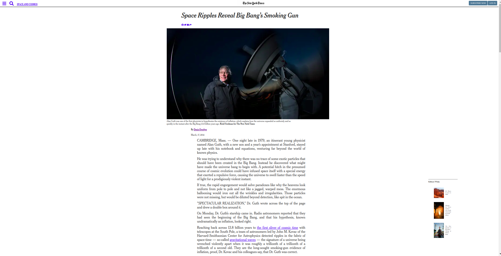

# Week 1 Positioning and Floating

> Creating first repository with Linter, separate commits and a HTML and CSS file

Additional description about the project and its features.

## Built With

- HTML
- CSS
- Linter

## Live Demo

[Live Demo Link](https://sergiocortessat.github.io/Week1_Positioning-and-Floating-Elements-/

## Getting Started

First Microverse Project Week 1 Position and Floating page.

## Authors

👤 Sergio Cortes Satizabal

- GitHub: [@githubhandle](https://github.com/sergiocortessat)
- Twitter: [@twitterhandle](https://twitter.com/sergiocortessat)
- LinkedIn: [LinkedIn](https://linkedin.com/sergiocortessat)

👤 Muhammad Ahtsham

- GitHub: [@githubhandle](https://github.com/mahtsham)
- Twitter: [@twitterhandle](https://twitter.com/mahtsham)
- LinkedIn: [LinkedIn](https://linkedin.com/mahtsham)

## 🤝 Contributing

Contributions, issues, and feature requests are welcome!

Feel free to check the [issues page](issues/).

## Show your support

Give a ⭐️ if you like this project!

## Acknowledgments

- Hat tip to anyone whose code was used
- Inspiration
- etc

## 📝 License

MIT License
Copyright (c) 2021 sergiocortessat mahtsham
Permission is hereby granted, free of charge, to any person obtaining a copy
of this software and associated documentation files (the "Software"), to deal
in the Software without restriction, including without limitation the rights
to use, copy, modify, merge, publish, distribute, sublicense, and/or sell
copies of the Software, and to permit persons to whom the Software is
furnished to do so, subject to the following conditions:
The above copyright notice and this permission notice shall be included in all
copies or substantial portions of the Software.
THE SOFTWARE IS PROVIDED "AS IS", WITHOUT WARRANTY OF ANY KIND, EXPRESS OR
IMPLIED, INCLUDING BUT NOT LIMITED TO THE WARRANTIES OF MERCHANTABILITY,
FITNESS FOR A PARTICULAR PURPOSE AND NONINFRINGEMENT. IN NO EVENT SHALL THE
AUTHORS OR COPYRIGHT HOLDERS BE LIABLE FOR ANY CLAIM, DAMAGES OR OTHER
LIABILITY, WHETHER IN AN ACTION OF CONTRACT, TORT OR OTHERWISE, ARISING FROM,
OUT OF OR IN CONNECTION WITH THE SOFTWARE OR THE USE OR OTHER DEALINGS IN THE
SOFTWARE.
